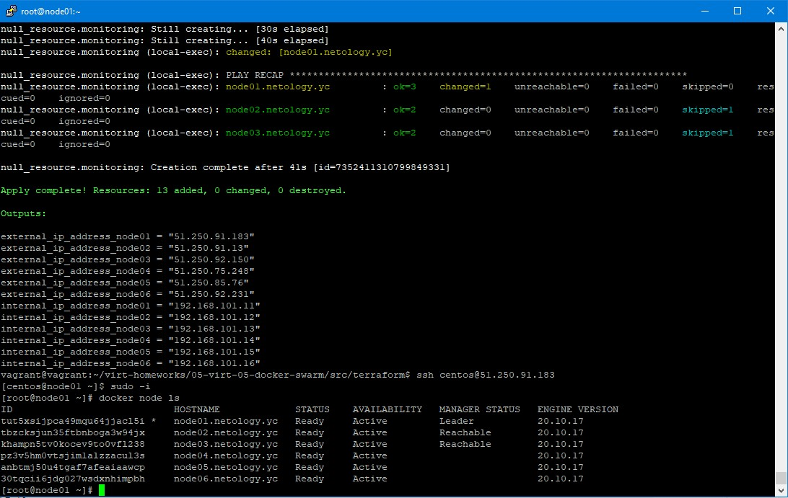
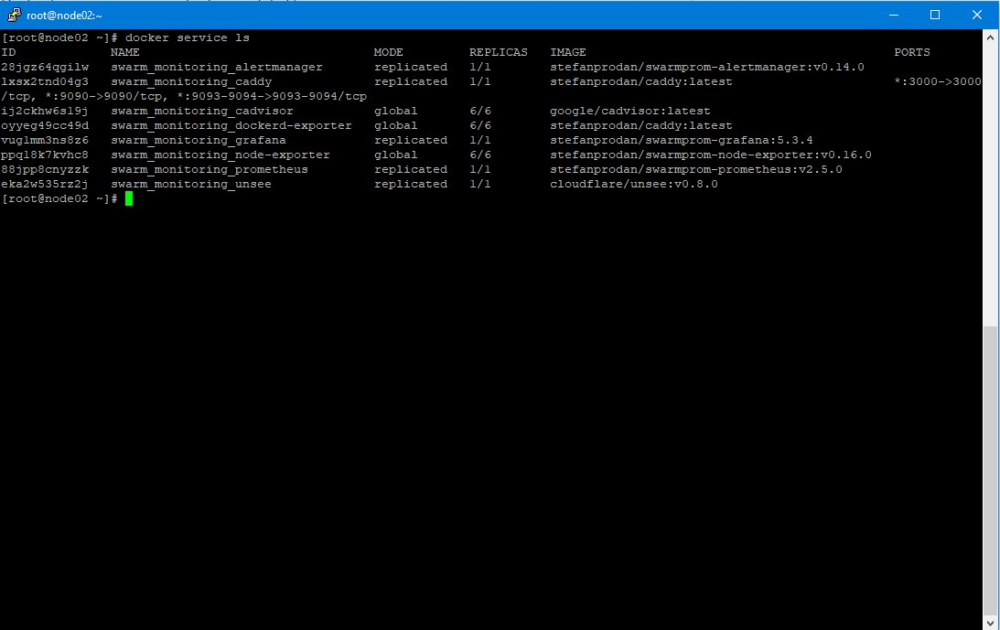

# Домашнее задание к занятию "5.5. Оркестрация кластером Docker контейнеров на примере Docker Swarm"

---

## Задача 1

Дайте письменые ответы на следующие вопросы:

- В чём отличие режимов работы сервисов в Docker Swarm кластере: replication и global?

```
Ответ:
В режиме global, реплики будут создаваться на каждой ноде в одном экземляре, в режиме replication
можно ограничивать количество реплик между нодами.
```

- Какой алгоритм выбора лидера используется в Docker Swarm кластере?

```
Ответ:
Выбор лидера происходит при инициализации docer swarm на хосте командой docker swarm init, он и станет лидером.
Если лидер по какой то причине станет недоступен, то кластер назначит новго лидера путем голосования
в автоматическом режиме
```

- Что такое Overlay Network?
```
Ответ:
Overlay Network это виртуальная сеть между узлами в кластере Docker swarm. С помошью такой сети, контейнеры
могут общаться между собой, находясь на разных узлах в кластере.
```

## Задача 2

Создать ваш первый Docker Swarm кластер в Яндекс.Облаке

Для получения зачета, вам необходимо предоставить скриншот из терминала (консоли), с выводом команды:
```
docker node ls
```
<p align="center">
  
</p>

## Задача 3

Создать ваш первый, готовый к боевой эксплуатации кластер мониторинга, состоящий из стека микросервисов.

Для получения зачета, вам необходимо предоставить скриншот из терминала (консоли), с выводом команды:
```
docker service ls
```
<p align="center">
  
</p>


