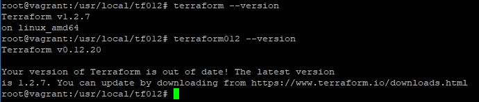

# Домашнее задание к занятию "7.1. Инфраструктура как код"

## Задача 1. Выбор инструментов. 
 
### Легенда
 
Через час совещание на котором менеджер расскажет о новом проекте. Начать работу над которым надо 
будет уже сегодня. 
На данный момент известно, что это будет сервис, который ваша компания будет предоставлять внешним заказчикам.
Первое время, скорее всего, будет один внешний клиент, со временем внешних клиентов станет больше.

Так же по разговорам в компании есть вероятность, что техническое задание еще не четкое, что приведет к большому
количеству небольших релизов, тестирований интеграций, откатов, доработок, то есть скучно не будет.  
   
Вам, как девопс инженеру, будет необходимо принять решение об инструментах для организации инфраструктуры.
На данный момент в вашей компании уже используются следующие инструменты: 
- остатки Сloud Formation, 
- некоторые образы сделаны при помощи Packer,
- год назад начали активно использовать Terraform, 
- разработчики привыкли использовать Docker, 
- уже есть большая база Kubernetes конфигураций, 
- для автоматизации процессов используется Teamcity, 
- также есть совсем немного Ansible скриптов, 
- и ряд bash скриптов для упрощения рутинных задач.  

Для этого в рамках совещания надо будет выяснить подробности о проекте, что бы в итоге определиться с инструментами:

1. Какой тип инфраструктуры будем использовать для этого проекта: изменяемый или не изменяемый?
```
Ответ:
На начальном этапе инфраструктура будет меняться однозначно, т.к. еще нет ТЗ еще не четкое и предпологается
большое количество релизов, тестирований, откатов и доработок. Но в production версии можно перейти и на
неизменяемую инфраструктуру.
```
2. Будет ли центральный сервер для управления инфраструктурой?
```
Ответ:
Ansible, CloudFormation, Terraform по умолчанию не требуют центрального сервера, можно обойтись и без него.
Но наличие центрального сервера дает некоторые приемущества, это единое централизованное место, где можно
просматривать и администрировать состояние своей инфраструктуры, непрерывнная работа в фоновом режиме для
обеспечения соблюдения конфигурации.
Итог: Центральному серверу быть.
```
3. Будут ли агенты на серверах?
```
Ответ:
Ansible, CloudFormation, Terraform не требуют установки никаких дополнительных агентов.
Обойдемся без них, но всегда есть нюансы которые нужно учитывать.
```
4. Будут ли использованы средства для управления конфигурацией или инициализации ресурсов? 
```
Ответ:
Однозначно да, если мы используем Ansible, CloudFormation, Terraform
```
 
В связи с тем, что проект стартует уже сегодня, в рамках совещания надо будет определиться со всеми этими вопросами.

### В результате задачи необходимо

1. Ответить на четыре вопроса представленных в разделе "Легенда". 
2. Какие инструменты из уже используемых вы хотели бы использовать для нового проекта? 
```
Ответ:
Ansible, Terraform, Packer, Docker
```
3. Хотите ли рассмотреть возможность внедрения новых инструментов для этого проекта? 
```
Ответ:
Пока ТЗ не четкое, пожно обойтись тем инструментом что есть, при развитии проекта и необходимости можно прибегнуть
к дополнительным инструментам но на 99% хватит и того что есть.
```
Если для ответа на эти вопросы недостаточно информации, то напишите какие моменты уточните на совещании.


## Задача 2. Установка терраформ. 

Официальный сайт: https://www.terraform.io/

Установите терраформ при помощи менеджера пакетов используемого в вашей операционной системе.
В виде результата этой задачи приложите вывод команды `terraform --version`.

## Задача 3. Поддержка легаси кода. 

В какой-то момент вы обновили терраформ до новой версии, например с 0.12 до 0.13. 
А код одного из проектов настолько устарел, что не может работать с версией 0.13. 
В связи с этим необходимо сделать так, чтобы вы могли одновременно использовать последнюю версию терраформа установленную при помощи
штатного менеджера пакетов и устаревшую версию 0.12. 

В виде результата этой задачи приложите вывод `--version` двух версий терраформа доступных на вашем компьютере 
или виртуальной машине.

```
Ответ на 2 и 3 задачи:
```
<p align="center">
  
</p>
