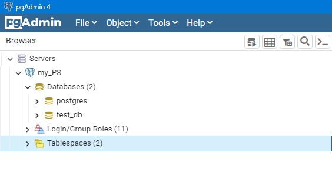
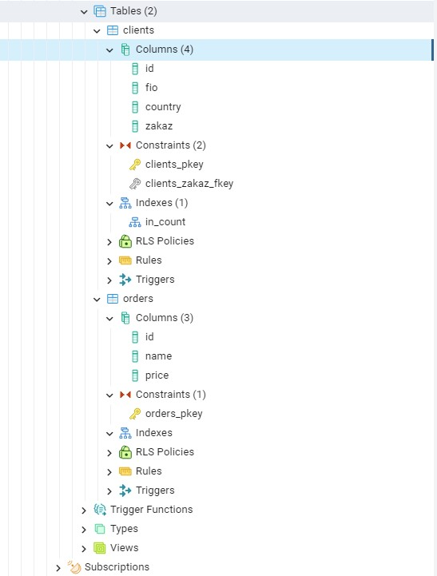
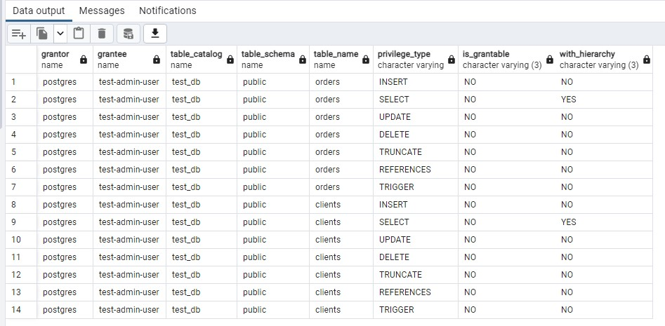
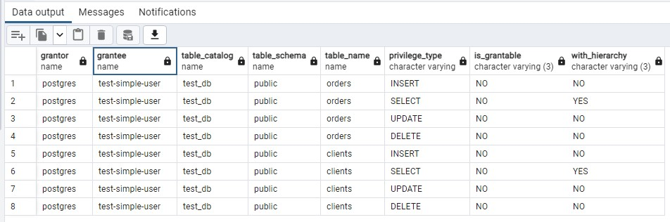
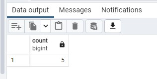
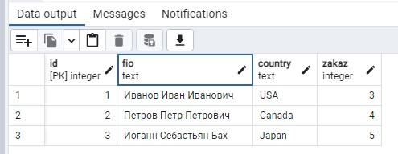
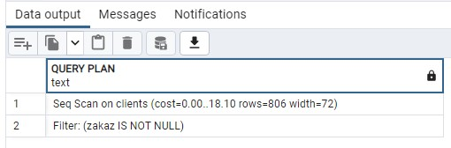

# Домашнее задание к занятию "6.2. SQL"

## Задача 1

Используя docker поднимите инстанс PostgreSQL (версию 12) c 2 volume, 
в который будут складываться данные БД и бэкапы.

Приведите получившуюся команду или docker-compose манифест.
```
Ответ:
Выполняем на заранее развернутом гостевом хосте c установленным Docker на virtualbox:
docker pull postgres:12
docker run -d --rm --name my_postgres -e POSTGRES_PASSWORD=postgres -e PGDATA=/data/pgdata -it -p 5432:5432 -v /data/pgdata:/data/pgdata -v /data/backup:/data/backup postgres:12
```

## Задача 2

В БД из задачи 1: 
- создайте пользователя test-admin-user и БД test_db
```
Ответ:
Установил pgAdmin, подключился к серверу (контейнеру) postgres, с проброшенным заранее портом 5432 в virtualbox 
CREATE USER "test-admin-user";
CREATE DATABASE test_db;
```
- в БД test_db создайте таблицу orders и clients (спeцификация таблиц ниже)
```
Ответ:
CREATE TABLE orders (id integer NOT NULL PRIMARY KEY, name text, price integer);
CREATE TABLE clients (id integer NOT NULL PRIMARY KEY, fio text, country text, zakaz integer, FOREIGN KEY (zakaz) REFERENCES orders (Id));
CREATE INDEX in_count ON clients (country);
```
- предоставьте привилегии на все операции пользователю test-admin-user на таблицы БД test_db
```
Ответ:
GRANT ALL ON orders, clients TO "test-admin-user";
```
- создайте пользователя test-simple-user  
```
Ответ:
CREATE USER "test-simple-user";
```
- предоставьте пользователю test-simple-user права на SELECT/INSERT/UPDATE/DELETE данных таблиц БД test_db
```
Ответ:
GRANT SELECT, INSERT, UPDATE, DELETE ON orders, clients TO "test-simple-user";
```

Таблица orders:
- id (serial primary key)
- наименование (string)
- цена (integer)

Таблица clients:
- id (serial primary key)
- фамилия (string)
- страна проживания (string, index)
- заказ (foreign key orders)

Приведите:
- итоговый список БД после выполнения пунктов выше,

Ответ:
<p align="center">
  
</p>

- описание таблиц (describe)

Ответ:
<p align="center">
  
</p>

- SQL-запрос для выдачи списка пользователей с правами над таблицами test_db
```
Ответ:
SELECT * FROM information_schema.table_privileges where grantee in ('test-admin-user');
SELECT * FROM information_schema.table_privileges where grantee in ('test-simple-user');
```

- список пользователей с правами над таблицами test_db

Ответ:
<p align="center">
  
  
</p>

## Задача 3

Используя SQL синтаксис - наполните таблицы следующими тестовыми данными:

Таблица orders

|Наименование|цена|
|------------|----|
|Шоколад| 10 |
|Принтер| 3000 |
|Книга| 500 |
|Монитор| 7000|
|Гитара| 4000|

```
INSERT INTO orders VALUES (1, 'Шоколад', 10), (2, 'Принтер', 3000), (3, 'Книга', 500), (4, 'Монитор', 7000), (5, 'Гитара', 4000);
```
Таблица clients

|ФИО|Страна проживания|
|------------|----|
|Иванов Иван Иванович| USA |
|Петров Петр Петрович| Canada |
|Иоганн Себастьян Бах| Japan |
|Ронни Джеймс Дио| Russia|
|Ritchie Blackmore| Russia|

```
INSERT INTO clients VALUES (1, 'Иванов Иван Иванович', 'USA'), (2, 'Петров Петр Петрович', 'Canada'), (3, 'Иоганн Себастьян Бах', 'Japan'), (4, 'Ронни Джеймс Дио', 'Russia'), (5, 'Ritchie Blackmore', 'Russia');
```

Используя SQL синтаксис:
- вычислите количество записей для каждой таблицы 
- приведите в ответе:
    - запросы 
    - результаты их выполнения.
```
Ответ:
SELECT COUNT (*) FROM orders;
SELECT COUNT (*) FROM clients;
```
Ответ:
<p align="center">
  
  
</p>

## Задача 4

Часть пользователей из таблицы clients решили оформить заказы из таблицы orders.

Используя foreign keys свяжите записи из таблиц, согласно таблице:

|ФИО|Заказ|
|------------|----|
|Иванов Иван Иванович| Книга |
|Петров Петр Петрович| Монитор |
|Иоганн Себастьян Бах| Гитара |

Приведите SQL-запросы для выполнения данных операций.
```
Ответ:
UPDATE  clients SET zakaz = 3 WHERE ID = 1;
UPDATE  clients SET zakaz = 4 WHERE ID = 2;
UPDATE  clients SET zakaz = 5 WHERE ID = 3;
```
Приведите SQL-запрос для выдачи всех пользователей, которые совершили заказ, а также вывод данного запроса.
 ```
Ответ:
SELECT * FROM clients WHERE zakaz IS NOT null;
```

<p align="center">
  
</p>

Подсказк - используйте директиву `UPDATE`.

## Задача 5

Получите полную информацию по выполнению запроса выдачи всех пользователей из задачи 4 
(используя директиву EXPLAIN).

```
Ответ:
EXPLAIN SELECT * FROM clients WHERE zakaz IS NOT null;
```
Приведите получившийся результат и объясните что значат полученные значения.

<p align="center">
  
</p>

```
Ответ:
Получили ожидаемую стоимость выполнения оператора, которая показывает, сколько, по мнению планировщика,  
будет выполняться этот оператор.
```
## Задача 6

Создайте бэкап БД test_db и поместите его в volume, предназначенный для бэкапов (см. Задачу 1).

```
Ответ:
docker exec -t my_postgres pg_dump -U postgres test_db -f /data/backup/backup_test_db.sql
```

Остановите контейнер с PostgreSQL (но не удаляйте volumes).

```
Ответ:
docker stop my_postgres
```

Поднимите новый пустой контейнер с PostgreSQL.

```
Ответ:
docker run -d --rm --name my_postgres2 -e POSTGRES_PASSWORD=postgres -e PGDATA=/data/pgdata2 -it -p 5433:5432 -v /data/pgdata2:/data/pgdata2 -v /data/backup:/data/backup postgres:12
```

Восстановите БД test_db в новом контейнере.

```
Ответ:
CREATE DATABASE test_db_new
docker exec -d my_postgres2 psql -U postgres -d test_db_new -f /data/backup/backup_test_db.sql
```

Приведите список операций, который вы применяли для бэкапа данных и восстановления. 

